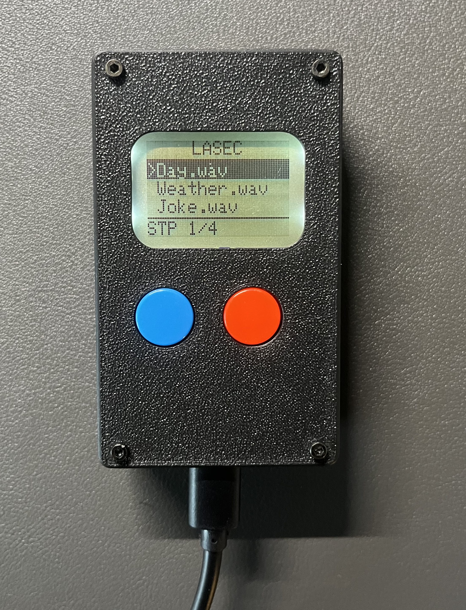

# Laser Audio Injection

Amplitude-modulate a laser with audio, point it at a MEMS microphone, and the voice assistant processes it as a real voice command. Based on the [Light Commands](https://lightcommands.com/) research.

The PDM signal from the ESP32's I2S peripheral drives a MOSFET that switches the laser at ~960 kHz. The time-averaged intensity encodes the audio. When it hits the mic port, the ASIC's photoelectric response does the rest.

Tested on Google Home Mini — works up to ~30 ft with a 5 mW laser.



---

## Branches

| Branch | What it does |
|--------|-------------|
| `main` | SD card file browser, Nokia 5110 display, play/pause & next buttons |
| `screen-test` | Display test with audio baked into the firmware |
| `flash-only` | Bare minimum — laser PDM, no display, audio in flash |

---

## Hardware

| Part | Notes |
|------|-------|
| XIAO ESP32-C6 | |
| N-channel logic-level MOSFET | P40NF03L or similar — needs fast switching (~5 ns) |
| 220 Ω resistor | Gate series resistor |
| 10 kΩ resistor | Gate pulldown |
| Laser diode module | 5 mW, ~650 nm works well |
| Nokia 5110 / PCD8544 LCD | 84×48, 8-pin SPI |
| MicroSD module (SPI) | Needs 5V supply |
| 2× push buttons | Play/pause and next |

---

## Pin Assignments

| Signal | GPIO | Pin |
|--------|------|-----|
| Laser PDM | GPIO0 | D0 |
| Play button | GPIO1 | D1 |
| Display DC | GPIO23 | D5 |
| SD CS | GPIO16 | D6 |
| Next button | GPIO17 | D7 |
| SPI SCK | GPIO19 | D8 |
| SD MISO | GPIO20 | D9 |
| SPI MOSI | GPIO18 | D10 |
| Display RST | GPIO21 | — |
| Display CS | GPIO22 | — |

See [`wiring.md`](wiring.md) for the full diagram.

---

## Preparing audio

Record or find a WAV of the command you want to inject. In Audacity:

1. Open your audio file
2. **Tracks → Stereo to Mono** if it's stereo
3. Set the project rate to **16000 Hz** (bottom-left dropdown)
4. **File → Export Audio** → WAV format, Unsigned 8-bit PCM encoding
5. Copy the exported file to the root of the SD card

The device lists all `.wav` files on boot automatically.

---

## Setup

Open in VS Code with PlatformIO installed, then flash:

```bash
pio run -t upload
```

---

## Enclosure

STL files for the 3D printed handheld enclosure are in the [`STL files/`](STL%20files/) folder.

---

## Notes

- SD module won't init reliably at 3.3V — it needs the 5V USB rail.
- Laser doesn't activate on boot. I2S is initialized lazily on the first button press.
- Display contrast default is 60. Adjust `display.setContrast()` if it looks off.
- macOS creates `._` shadow files on FAT volumes — the firmware filters these out.
